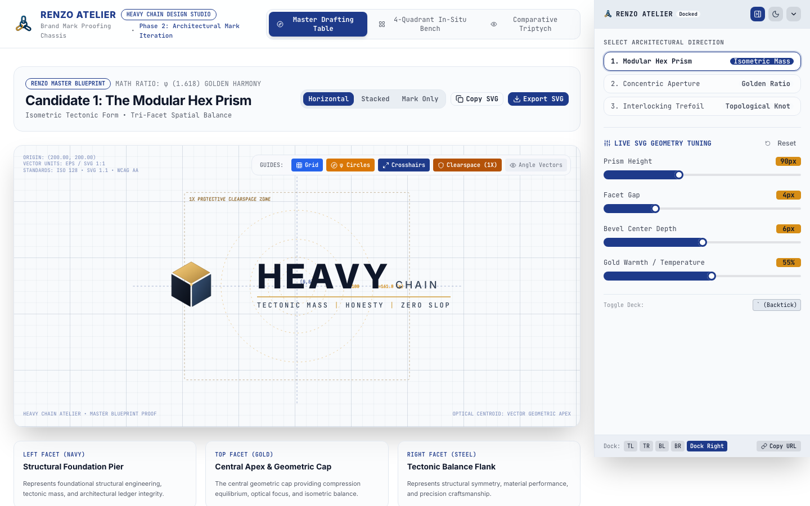
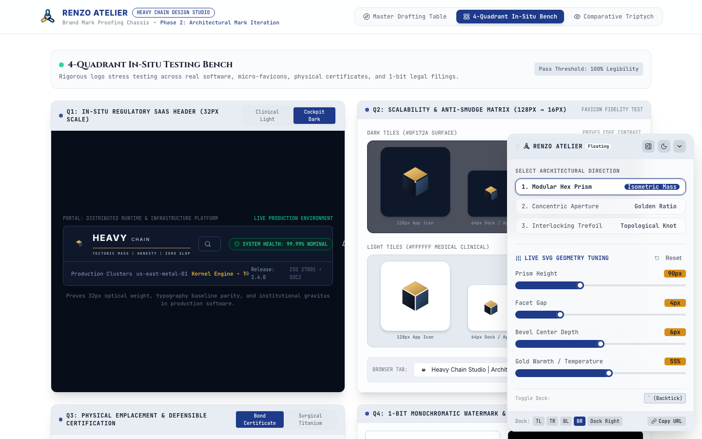
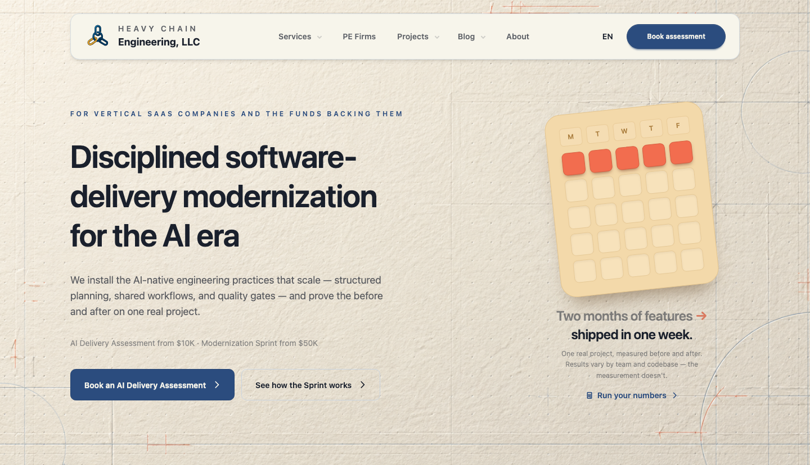
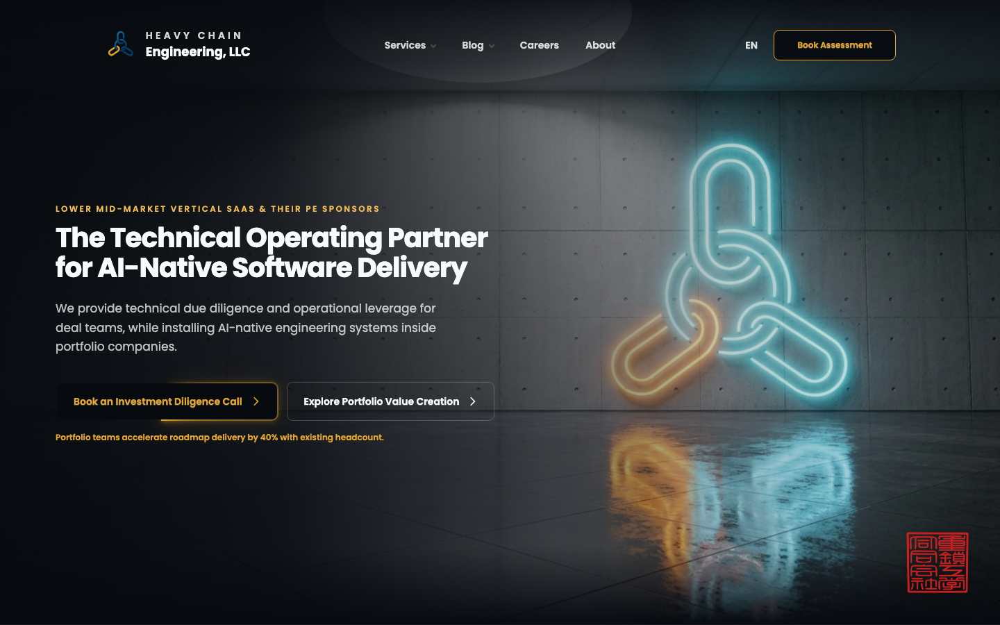
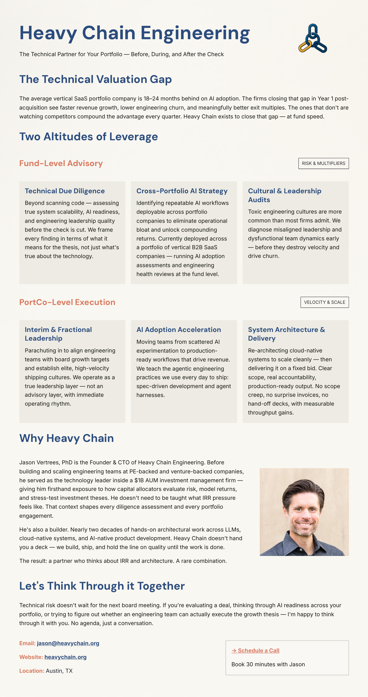
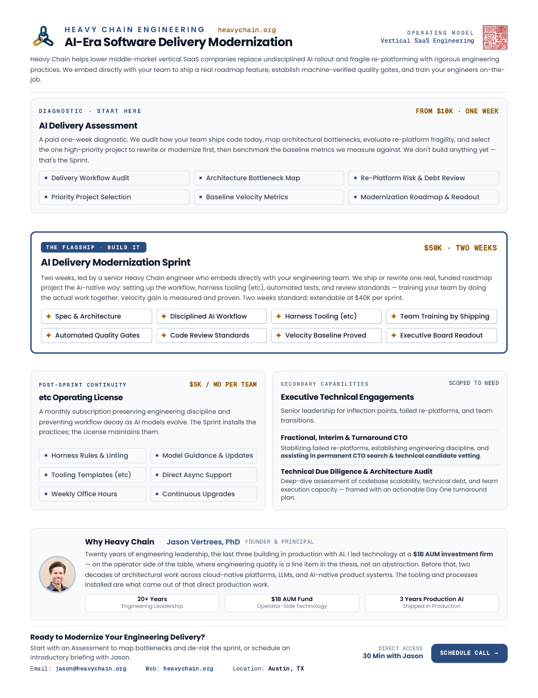

<p align="center">
  
</p>

<h1 align="center">Heavy Chain Design Studio</h1>

<p align="center">
  <strong>A guided visual design loop for technical minds. Helps engineers build clean, non-terrible UI without getting trapped in generic AI slop.</strong>
</p>

<p align="center">
  <a href="https://skills.sh"></a>
  <a href="LICENSE"></a>
  <a href="#quickstart--installation"></a>
</p>

## Why This Exists

Engineers know when an interface looks cheap, cluttered, or generic. The problem is that typing prompts into a chat box is a terrible way to fix visual design.

### The Two Rounds of AI Slop

When you build with AI coding tools, the visual loop almost always plays out in two predictable stages:

1. **Round 1 (The Default Slop)**: You ask an AI to build a page or component. You immediately get the standard generative-AI signature: floating glass cards, purple-to-cyan glow gradients, pulsing status pills, and arbitrary decorative borders masking an unstructured layout. In Round 1, your interface looks like everyone else on the internet who typed *"make me a website."*
2. **Round 2 (The High-Effort Slop Trap)**: Because you care about craft, you refuse to ship Round 1. You push back: *"Make it cleaner. Strip the cheesy gradients. Make it look modern and minimal."* You spend hours prompt-engineering to de-slop the output. But prompt-based iteration simply swaps loud clichés for polite ones. You end up in a second tier of AI slop—sterile, uninspired, and still unmistakably machine-generated. You now just look like the subset of people who pushed a little harder, but with zero distinct character or authentic point of view.

Chatting with an AI cannot break out of that local minimum because subjective adjectives (*"cleaner"*, *"more modern"*, *"sleeker"*) simply shuffle probability weights across the same generic training data.

### Breaking the Ceiling: The Architectural Charrette

The only workflow we've found that reliably breaks through this ceiling is adapting the classic **[architectural charrette](https://en.wikipedia.org/wiki/Charrette)** (an intensive, time-boxed session where designers and stakeholders rapidly draft, critique, and resolve design problems together) into an automated software loop:

- **Isolate independent variables**: Instead of trying to fix layout, colors, typography, and copy simultaneously, the studio separates them strictly. Settle structural mass and contrast first, then lock in typographic hierarchy, and only then dial in micro-spacing.
- **In-situ browser prototyping**: You cannot evaluate visual weight from a terminal diff or static mockup. You test candidates live inside your running application using an interactive DevTools-style control deck.
- **Negative falsification**: Instead of trying to describe an ideal design into an empty prompt, you evaluate three polarized, contrasting directions side-by-side. It is far easier to eliminate what doesn't work than to invent a visual system from scratch.
- **Pragmatic completion**: Once the layout is clean, legible, and achieves the project objective, lock it in and ship.

It is not a magic silver bullet, but across real projects, it is the most practical workflow we've found to eliminate AI slop and consistently produce interfaces you're actually proud to ship.

## Requirements

- **AI Coding Agent**: [Claude Code](https://claude.ai/code), [Google Antigravity / Gemini CLI](https://github.com/google-gemini), [Cursor](https://cursor.com), or any coding agent environment supporting skill manifests (`SKILL.md`).
- **Node.js**: Node 18.0+ (Node 20+ recommended) and `npm`, `pnpm`, or `bun` for running the local Vite workbench dev server.
- **Modern Web Browser**: Chrome, Edge, Safari, Firefox, or Brave for live in-situ evaluation and candidate switching.
- **Git**: For cloning the repository and version control.

## Quickstart & Installation

### Option 1: Universal Install via Skills CLI (`skills.sh`)
The recommended way to install for **Claude Code**, **Antigravity / Gemini CLI**, **Cursor**, and other agent environments:

```bash
npx skills add Heavy-Chain-Engineering/design-studio
```

To install globally:
```bash
npx skills add Heavy-Chain-Engineering/design-studio -g -y
```

### Option 2: Project-Level Install (Antigravity / Gemini CLI)
Clone or copy into your project's `.agents/skills` directory:

```bash
mkdir -p .agents/skills
git clone https://github.com/Heavy-Chain-Engineering/design-studio.git .agents/skills/design-studio
```

### Option 3: Global Install (Antigravity / Gemini CLI)
```bash
git clone https://github.com/Heavy-Chain-Engineering/design-studio.git ~/.gemini/config/skills/design-studio
```

## How to Use

Invoke the skill directly in your AI coding assistant:

```text
/design-studio
```
*(Or simply prompt: "Let's run a design studio session on the landing page hero" or "I need to design a logo mark.")*

### Step 1: The Quick Intake

Before touching code, the studio quickly anchors on four practical constraints:

1. **Objective**: What is this surface supposed to achieve (e.g., convert deal teams, explain technical architecture)?
2. **Medium**: Web application, marketing landing page, print flyer, or standalone brand mark / logo?
3. **Tone**: Direct engineering truth, institutional credibility, or playful dev tool?
4. **Hard constraints**: Banned colors, mandatory brand assets, or existing design tokens.

> **Tip**: Dictate a 60-second braindump using your OS dictation tool and paste it in. The studio will parse the constraints and set up the appropriate environment.

### Bringing Your Own House Style & Rules

Design Studio is style-agnostic—the architectural charrette is a process, not a rigid aesthetic. On launch, the studio automatically scans your repository for existing design rules, house tokens, and brand assets:

- **Codified Guidelines & Rules**: `DESIGN.md`, `brand.yaml`, `docs/design/`, `brand-aesthetic-and-taste.md`, or `DOMAIN.md`.
- **Design Tokens & Themes**: `tailwind.config.*`, CSS custom property themes, or DaisyUI theme blocks.
- **Brand Assets**: Custom web fonts, existing logos, and marks in `public/`.

If detected, Renzo acknowledges what is already codified and enforces your existing house style as the baseline. If no rules file exists, the quick intake prompts for your preferences and constraints to establish a clean starting vector.

### Step 2: The Two Studio Environments

Different design mediums require different testing environments. Rather than forcing everything into a one-size-fits-all mockup, Design Studio automatically chooses between two workflows:

#### Mode A: The Standalone Workbench (For Brand Marks, Logos & Print Collateral)
When designing standalone visual assets—logos, vector brand marks, flyers, or executive one-pagers—the studio spins up a dedicated local dev server running the **Studio Workbench** (included in `templates/brand-mark-studio`).

<a href="docs/images/workbench-preview.png"></a>

The workbench provides three purpose-built evaluation surfaces directly in your browser:
- **The Master Drafting Table**: An interactive vector canvas with mathematical construction grids, geometric alignment axes, and one-click SVG export.
- **The Physical & Scale Testing Bench**: Tests your asset in real-world contexts simultaneously—scaled down to a 16px favicon, embedded in a realistic application header, placed on physical paper textures, and inverted across high-contrast light and dark backgrounds.
- **The Comparative Triptych**: Presents three distinct, polarized candidates (A, B, and C) side-by-side with explicit trade-off notes so you can eliminate bad directions immediately.

*This starting design workbench updates live as you and Renzo advance through each round of the charrette.*

#### Mode B: The Floating In-Situ Console (For Web Apps & Landing Pages)
You can't wrap an existing, full-stack website or complex web application inside an artificial workbench dashboard without breaking styles, CSS cascades, and bundler setups.

<a href="docs/images/floating-console-preview.png"></a>

Instead, for web applications and landing pages, the studio injects the **Renzo Atelier Deck**—a lightweight, non-invasive floating drawer—directly into your existing running app (`localhost:3000`, `localhost:5173`, etc.):

- **Live In-Situ Variant Switching**: Instantly toggle between candidate directions (`Candidate A` vs. `Candidate B` vs. `Candidate C`) inside your actual DOM, with real routing, real fonts, and real responsive breakpoints.
- **Real-Time Environment Toggling**: Flip between light and dark modes, run high-contrast stress tests, or adjust layout parameters (padding, line-height, container widths) on the fly.
- **Zero Production Residue**: The floating console exists only during your design session. Once you approve a candidate, the studio promotes the winning markup to production and cleanly removes the temporary harness.

*This default floating console updates in real time with candidate variants (A vs. B vs. C), theme toggles, and parameter sliders as you work through the charrette.*

### Step 3: Renzo Drives the Iteration

You never have to manually edit markup, wrestle with SVG math, or context-switch into code editor details while evaluating visual taste:

1. **You react in natural language**: Give your raw, honest gut feedback to Renzo in chat (*"Option A feels too corporate; Option C has great energy but the mark gets muddy at 24px"*).
2. **Renzo drives the updates**: Renzo acts as your visual director, translating your feedback into concrete spatial, typographic, and contrast adjustments, and orchestrating code changes in the background.
3. **Inspect live in your browser**: The dev server hot-reloads the changes immediately on your workbench or in your app.
4. **Lock and ship**: When the candidate passes scrutiny across all viewports and scales, the studio locks the design, extracts design tokens, and completes the handoff.

## Before & After Showcase

Real-world transformations comparing typical engineer / LLM defaults against calibrated studio outputs.

### Case 1: Homepage Hero Redesign (heavychain.org)

Replacing engineer-default drafting paper with a grounded architectural plate.

| Before (Drafting Paper & Tilted Card) | After (Concrete Plate & Emissive Mark) |
| :---: | :---: |
| <a href="docs/images/case-studies/hero-before.png"></a><br><sub>[View full-res](docs/images/case-studies/hero-before.png)</sub> | <a href="docs/images/case-studies/hero-after.png"></a><br><sub>[View full-res](docs/images/case-studies/hero-after.png)</sub> |

- **Before**: Skeuomorphic drafting paper background with a rotated (`-rotate-[6deg]`) calendar card. A well-meaning engineer attempt, but laden with AI slop tropes.
- **After**: Grounded board-formed concrete surface, 3D emissive neon trefoil with physical floor reflections (no fake dark drop shadows), clean contrast, and crisp deal-team positioning.

### Case 2: Executive Collateral & One-Pager

A real-world one-pager organizing multi-tier service offerings.

| Before (Loose Layout) | After (Structured Grid) |
| :---: | :---: |
| <a href="docs/images/case-studies/collateral-before-1.png"></a><br><sub>[View full-res](docs/images/case-studies/collateral-before-1.png)</sub> | <a href="docs/images/case-studies/collateral-after-1.png"></a><br><sub>[View full-res](docs/images/case-studies/collateral-after-1.png)</sub> |

- **Before**: Floating cards with identical visual weight, arbitrary drop shadows, and no clear focal point between the flagship offering and secondary services.
- **After**: Strong typographic hierarchy, the primary offering clearly emphasized with badge framing and pricing callout, and a balanced two-column grid below.

### Summary: Common LLM Defaults vs. Design Studio

| Dimension | Common LLM Defaults | Design Studio Approach |
| :--- | :--- | :--- |
| **Surfaces** | Generic blur gradients, pastel cards with arbitrary drop shadows. | Grounded physical surfaces (concrete, slate, matte paper) with believable lighting physics. |
| **Hierarchy** | Random colored accent bars (`border-l-2`) and pseudo-code comments (`// CORE`). | Disciplined whitespace, clear typographic cadence, and deliberate container widths. |
| **Lighting** | Objects cast dark drop shadows onto walls even when self-luminous. | Emissive marks cast radiant light and floor reflections; ungrounded drop shadows are avoided. |
| **Accessibility** | Low-contrast text on bright backgrounds that fail basic readability. | Semantic color pairs with strict WCAG AA contrast ($\ge 4.5:1$) in both light and dark modes. |
| **Evaluation** | Scrolling through terminal diffs or static PNGs. | Live in-browser control deck with side-by-side variant switching. |
| **Process** | The agent gets lost rewriting files in the background without alignment. | Clear separation: design counsel explores options with you while background subagents run builds. |

## Renzo & The Studio Model

- **Design Counsel, Not Theatrical Roleplay**: Renzo is a design partner persona focused on typography, spatial structure, and visual clarity. No stage directions (no `*pours espresso*`), no Italian caricatures, and no consultant fluff.
- **Separation of Concerns**: Renzo stays at the drafting table with you to evaluate design decisions. Background subagents handle file modifications, builds, and test verification—keeping the conversation focused on visual intent.
- **Pragmatic Completion**: The studio avoids endless pixel-polishing. When a design clearly satisfies the goal with high craft and solid structure, we lock it in and ship.

## Design Studio Guidelines

1. **Whitespace over decorative clutter**: Never add left accent bars (`border-l-2`) or fake code labels to fix an unstructured layout. Adjust whitespace, font weight, and grouping instead.
2. **Believable lighting**: If an element emits light, it illuminates adjacent surfaces. Luminous objects don't cast dark drop shadows.
3. **Substance over tricks**: Avoid relying on pulsing animations or floating glass layers to make an interface feel interesting. Build solid bones first.
4. **Contrast and accessibility**: Always enforce $\ge 4.5:1$ WCAG AA contrast across both light and dark themes using semantic color tokens.
5. **Container fitness**: Calculate and respect parent and sibling container bounds across viewports so layouts don't collide or awkwardly wrap.
6. **In-situ evaluation**: Always test changes in the running browser with interactive variant controls rather than relying solely on static mockups.
7. **Full-page inspection**: When capturing screenshots for review, inspect the full scrollable page height rather than cropping at the fold.
8. **Host codebase respect**: When running inside an existing project, work inside isolated directories (like `.studio/`) and never overwrite host metadata or favicons without consent.

## What's Inside This Repository

```text
design-studio/
├── SKILL.md                          # Root skill manifest (for single-skill CLI discovery)
├── plugin.json                       # Antigravity/Gemini plugin manifest
├── LICENSE                           # MIT License (Heavy Chain)
├── README.md                         # This documentation
├── skills/
│   └── design-studio/
│       ├── SKILL.md                  # Canonical skill definition
│       └── templates/
│           └── brand-mark-studio/    # Production-verified Vite + React + DaisyUI chassis
│               ├── src/
│               │   ├── components/
│               │   │   ├── bench/    # Master Drafting Table, Testing Bench, Triptych
│               │   │   ├── deck/     # Renzo Atelier Deck floating console
│               │   │   └── logos/    # Parametric vector marks & typography lockup
│               │   ├── types.ts
│               │   └── App.tsx
│               ├── package.json
│               └── tailwind.config.js
```

## License

Released under the [MIT License](LICENSE).  
Copyright © 2026 Heavy Chain.
